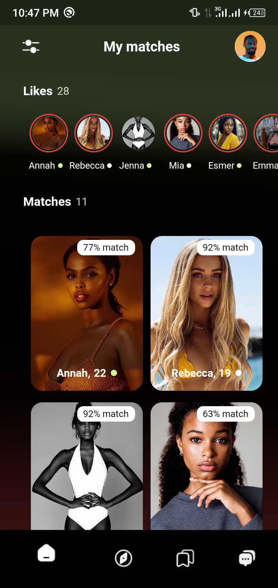
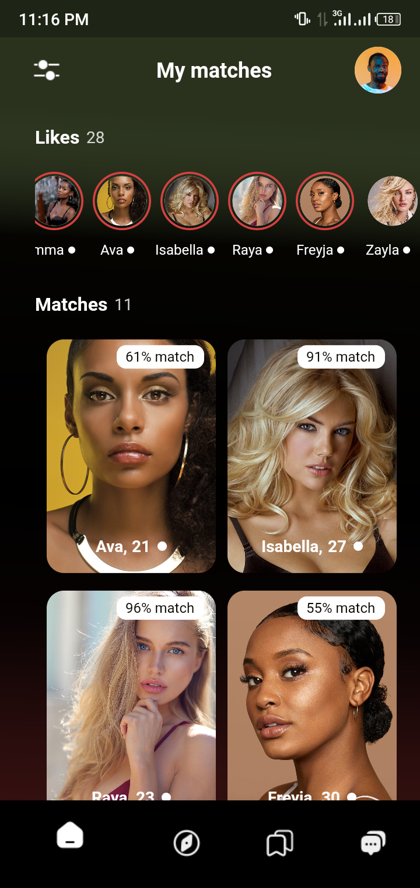
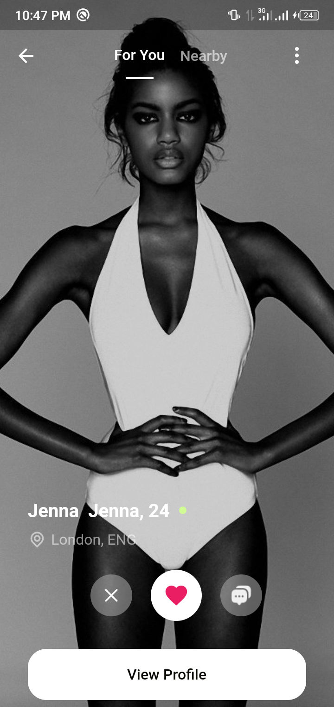
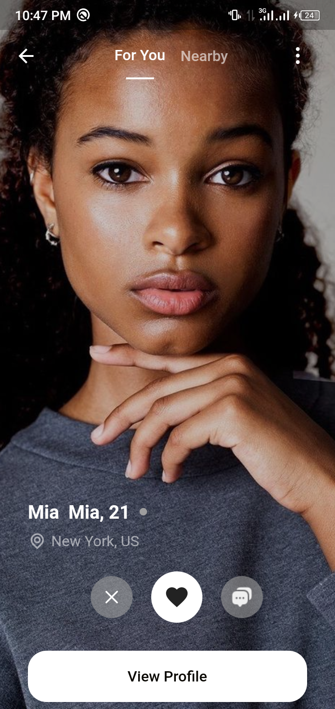
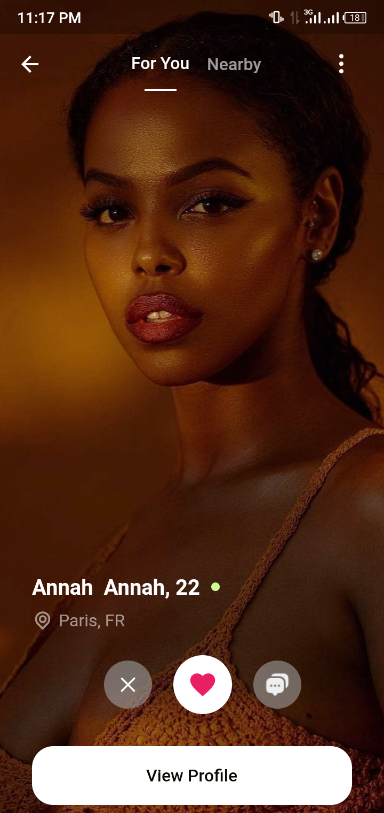
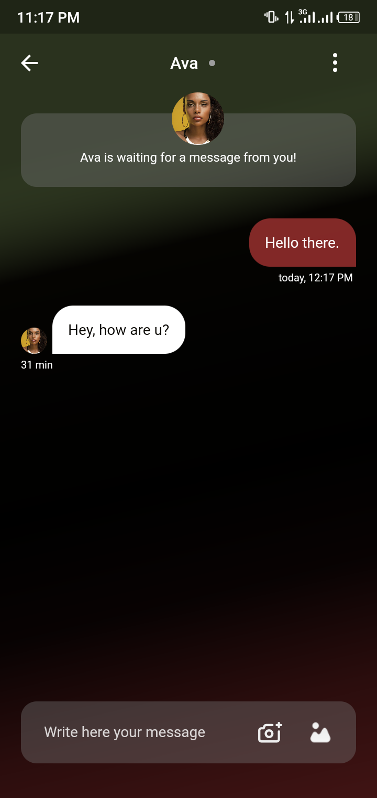

<div>







</div>


Dating UI design App, the UI was created inspired from one share on dribble and I made it using Flutter/Dart.

Give a star (⭐) the repo and follow me it really motivates me to share more open source 

## Installation


### Clone the repository
```
git clone https://github.com/Ferrozo/dating-app-ui-design-with-flutter.git
```
### Install the dependecies
```
flutter pub get
```
### Run the project

```
flutter run
```
